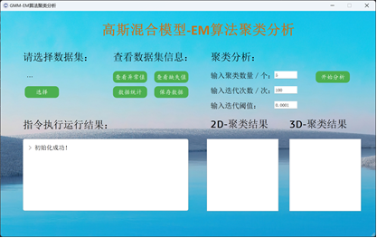
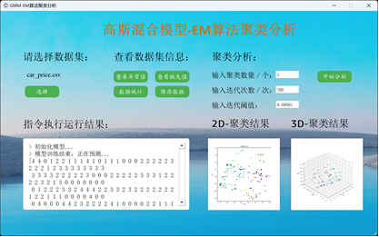

# GMM-EM算法聚类分析

## 1.程序概述
本程序是一个基于 PyQt5 和 GMM-EM 算法的聚类分析工具。用户可以通过该工具选择数据集文件，进行数据预处理、异常值检测、聚类分析等操作，并可视化显示聚类结果。

## 2.目录

```
  ├── front_end: 界面实现
  ├── back_end: GMM-EM算法实现
  ├── data_process: 数据预处理
  └── img: 图片文件
```

## 3.功能特点
- 选择数据集：用户可通过界面选择本地存储的数据集文件进行加载。
- 查看数据集信息：提供异常值检测、缺失值检测、数据统计等功能，帮助用户对数据集进行初步了解。
- 聚类分析：用户可以通过设置聚类数量、迭代次数、迭代阈值等参数，使用GMM-EM算法进行聚类分析。
- 可视化展示：支持在界面上展示2D和3D聚类结果的散点图。

## 4.主要界面及功能说明
1. **选择数据集界面**
   - 用户可以点击“选择”按钮选择本地数据集文件进行加载。

2. **数据预处理功能**
   - 提供异常值检测、缺失值检测、数据统计等功能，通过按钮触发对应操作并在输出框中显示结果。

3. **聚类分析功能**
   - 用户可以通过设置聚类数量、迭代次数、迭代阈值等参数，使用GMM-EM算法进行聚类分析，并将结果显示在输出框中。同时，程序将生成2D和3D聚类结果的散点图，并在界面上展示。

## 5.程序运行环境
- 操作系统：支持 Windows、Linux 和 macOS 等主流操作系统。
- Python 版本：要求 Python 3.10 以上。
- 相关库：PyQt5、OpenCV、NumPy、Pandas、Matplotlib 等。

## 6.使用步骤
1. 打开程序后，选择位于dataset目录下的数据集car_price.csv。
2. 对数据集进行预处理，包括异常值检测、缺失值检测等。
3. 设置聚类分析参数，如聚类数量、迭代次数等。
4. 点击“开始分析”按钮进行聚类分析。
5. 查看聚类结果，并在界面上查看2D和3D聚类结果的散点图。
6. 如需保存数据集，点击“保存数据”按钮。

## 7.注意事项
- 请确保数据集文件格式正确，并且每列数据类型一致。
- 聚类分析过程可能会较慢，具体时间取决于数据集大小和参数设置。
- 可根据实际需要调整聚类分析的参数，以获得更好的分析效果。

## 8.运行结果展示

